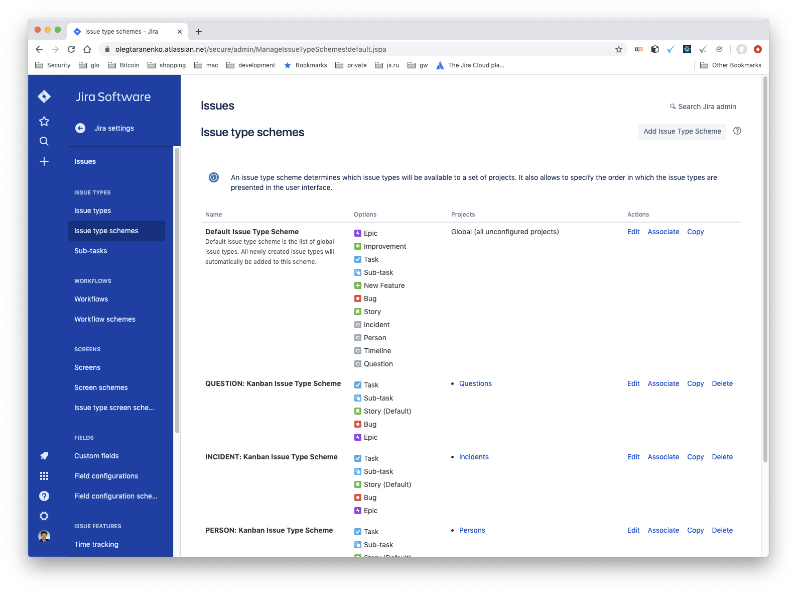
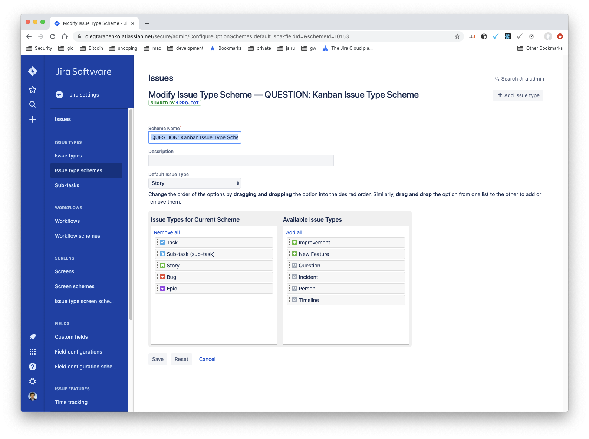
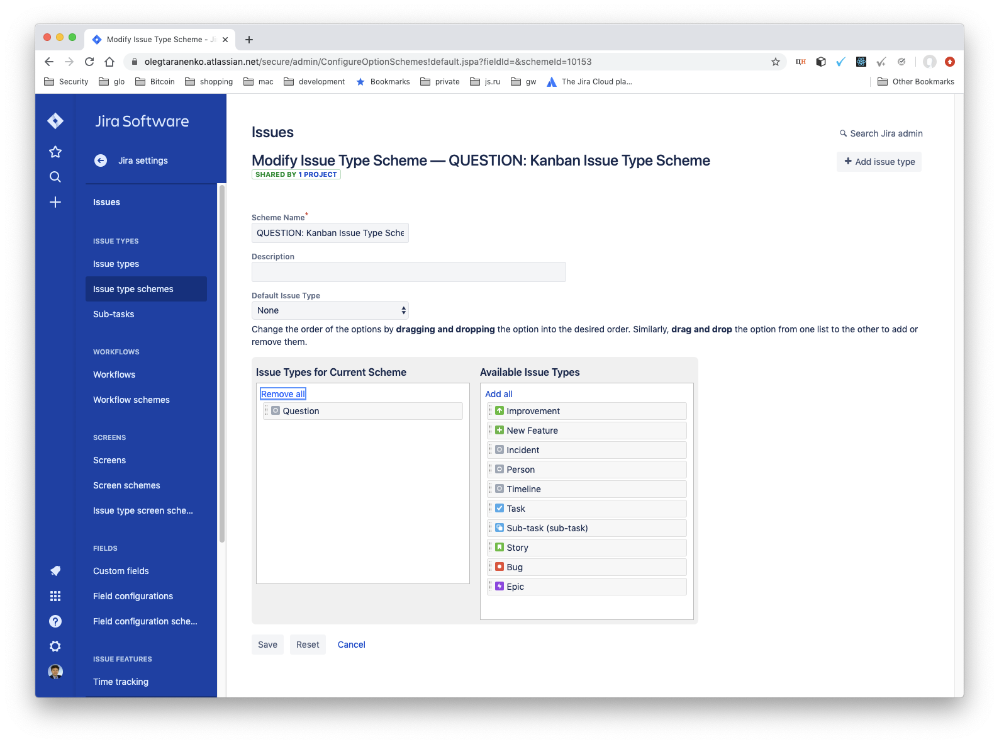

# Jira configuration

In order to generate fake Jira projects and issues (for testing and
development purposes), execute the following steps:

## Step 1
Create **issue types** and **projects**
```
dotenv run python -m jpi.tools.jira_configuration --step 1
```
## Step 2

To check Project creation open in browser
[Projects - Jira](https://glasswall-dev.atlassian.net/secure/BrowseProjects.jspa)

Navigate to 
[Issue Type Schemes - Jira](https://glasswall-dev.atlassian.net/secure/admin/ManageIssueTypeSchemes!default.jspa)
Issue Type Schemes at the beginning


Open every Issue Type Scheme


Manually edit the Scheme and leave only one Issue Type per correspondent
Project. Click Save button.


The final screen should looks like 


## Step 3

Run script to finalize JIRA configuration.

```
dotenv run python -m jpi.tools.jira_configuration --step 2
```
