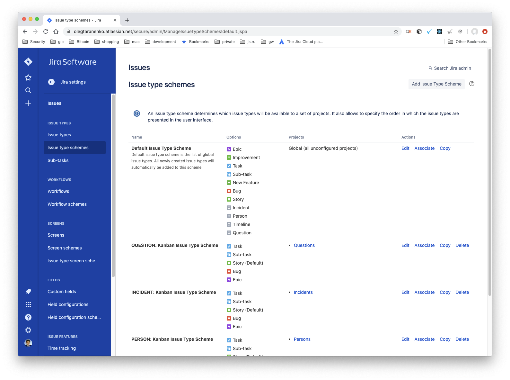
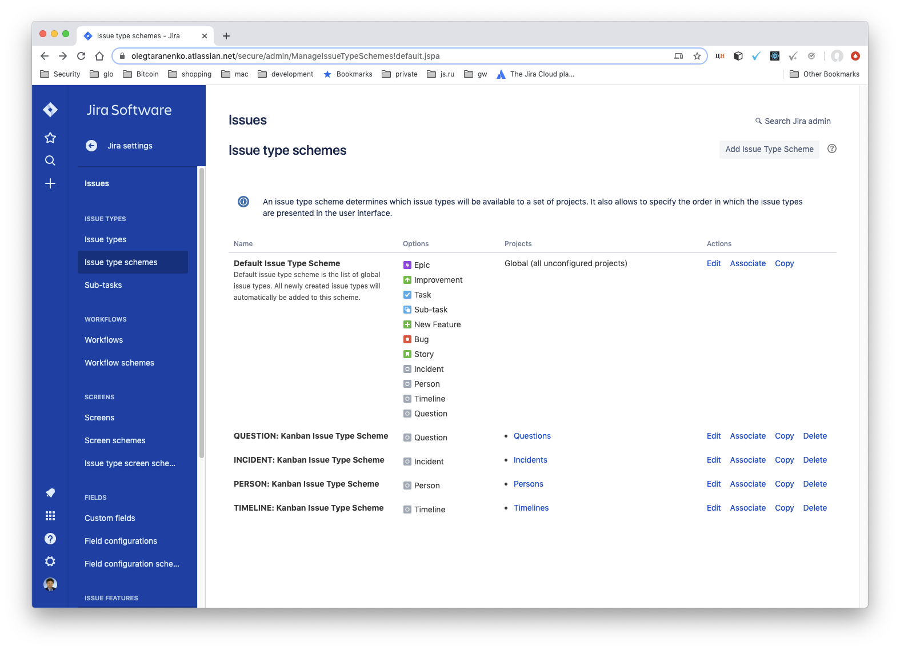

# Project installation and configuration

Clone the project:

```
git clone git@github.com:filetrust/jira-pagerduty-integration.git
```

and cd to the project directory:

```
cd jira-pagerduty-integration
```

## Make and activate a virtual environment:

```
pipenv --python 3.7
source $(pipenv --venv)/bin/activate
```

## Install python dependencies

```
pipenv install --dev
```

## Install `serverless`:

### Install `npm`

If you don't have `npm` installed, you can install it by means of the
following command:

```
nodeenv -p
```

Now install `serverless`:

```
npm install -g serverless
```

and other dependencies:

```
npm install
```

## Install and run local DynamoDB

Install DynamoDB by means of the following command:

```
sls dynamodb install
```

and start it

```
sls dynamodb start
```

## PagerDuty and Jira API tokens

### PagerDuty API tokens

Go to [API Access Keys](https://atykhonov2.pagerduty.com/api_keys) and
create a new API key.

### Jira API tokens

Go to [API tokens](https://id.atlassian.com/manage/api-tokens) and
create an API token.

## Create a configuration file

Copy `.env.example` to `.env` and edit it. Put your email to
`JIRA_USER_EMAIL` and `PAGERDUTY_USER_EMAIL`, put the API tokens to
`JIRA_API_TOKEN` and `PAGERDUTY_API_TOKEN`, put your atlassian root
URL (e.g. https://username.atlassian.net) to `JIRA_SERVER_URL`.

Put the full name of PagerDuty user into `PAGERDUTY_USER_NAME`
variable (this is for the dev and test environments only, i.e. no
needs to have the variable configured on production
environment). During execution of `jpi.tools.jira-configuration` (see
below) the full name is used to create a Jira issue in `PERSON`
project. When a Jira issue is created by the integration, a Jira issue
(in `PERSON` project) is searched by PagerDuty assignee. If the issue
is found then it is linked to the newly created issue using `Incident
Manager` link type.

## Jira configuration

In order to generate fake Jira projects and issues (for testing and
development purposes), execute the following steps:

#### Step 1
Create **issue types** and **projects**
```
dotenv run python -m jpi.tools.issue-types
```
#### Step 2

To check Project creation open in browser
[Projects - Jira](https://olegtaranenko.atlassian.net/secure/BrowseProjects.jspa)

Navigate to 
[Issue Type Schemes - Jira](https://olegtaranenko.atlassian.net/secure/admin/ManageIssueTypeSchemes!default.jspa)
Issue Type Schemes at the beginning


Open every Issue Type Scheme


Manually edit the Scheme and leave only one Issue Type per correspondent
Project. Click Save button.


The final screen should looks like 



#### Step 3

Run script to finalize JIRA configuration.
```
dotenv run python -m jpi.tools.jiraconfiguration
```

## PagerDuty configuration

Go to [Incident Priority Settings
](https://glasswall-qa.pagerduty.com/account/incident_priorities) and
make sure that Incident Priority Levels are enabled.

## AWS configuration

Configure `awscli` on your machine:

```
aws configure
```

Then do the remaining AWS configurations using the following command:

```
./jpi/tools/aws-configuration.sh
```

The command creates a role and outputs its ARN. Put the ARN into
`CFN_ROLE_ARN` variable (`.env` file).

## Serve the WSGI application locally

Execute the following command in order to start the local server:

```
sls wsgi serve
```

## Expose your local web server.

Download, install and execute [ngrok](https://ngrok.com):

```
ngrok http 5000
```

Use the https URL to create the URLs for PagerDuty and Jira
webhooks (read below).

## Configure PagerDuty webhook

Go to [Extensions](https://yourusername.pagerduty.com/extensions) and
create a webhook with `Extension Type` equals to `Generic V2 Webhook`,
`Name` equals to `jpi`, `Service` equals to any available service that
you created before and URL equals to `<ngrok-url>/pagerduty-webhook`.

## Configure Jira webhook

Go to [System
WebHooks](https://yourusername.atlassian.net/plugins/servlet/webhooks)
and create a webhook with any convenient name and with URL equals to
`<ngrok-url>/jira-webhook`.

## Test the configuration

Go to PagerDuty and create an incident with any `Impacted Service`,
with any convenient `Title` and with `Incident Priority` equals to
`P1`. Go to Jira, open `Incidents` project and check the issues. You
should see the newly created issue with the same title you just
inputed.

## Scheduled functions

The functionality of the project depends on `cron` and
`log_entries_polling` functions that should be executed
periodically. On a dev environment these functions are not executed
periodically so they should be manually trigerred when you need them
to be executed, e.g.:

```
IS_OFFLINE=True sls invoke local -f log_entries_polling
```

Create an incident with `Incident Priority` equals to `P2`. An
incident created with priority other than `P1` shouldn't be
automatically created in Jira. But, accordingly to the requirements,
when priority is changed to `P1` an issue should be created in
Jira. The responsibility of `cron` function is to monitor the existing
incidents and act respectively on priority change. Change `Incident
Priority` to `P1` of the recently created incident and execute the
following command:

```
IS_OFFLINE=True sls invoke local -f cron
```

You should get something like the following in response:

```
{
    "retrieved": 26,
    "created": 1,
    "changed": 0,
    "tracked": 0
}
```

As you can see `Created` equals to `1` which means that the priority
change was succesfully detected and Jira issue was created.

# Deploy serverless application to dev environment (AWS)

In order to deploy the application execute the following command:

```
sls deploy
```

The command should output an endpoint URL, for instance:

```
[...]
endpoints:
  ANY - https://oqzgxd0euf.execute-api.us-east-1.amazonaws.com/dev
  ANY - https://oqzgxd0euf.execute-api.us-east-1.amazonaws.com/dev/{proxy+}
[...]

```

Use the endpoint URL to configure the webhooks in PagerDuty and Jira.

In order to execute the scheduled functions (`cron` or
`log_entries_polling`) use the following command:

```
sls invoke local -f cron
```

# Deploy serverless application to qa environment

In order to deploy the application to qa environment execute the
following commands:

```
sls login
sls deploy --env qa
```

The scheduled functions should be executed automatically (no needs to
execute them manually).
